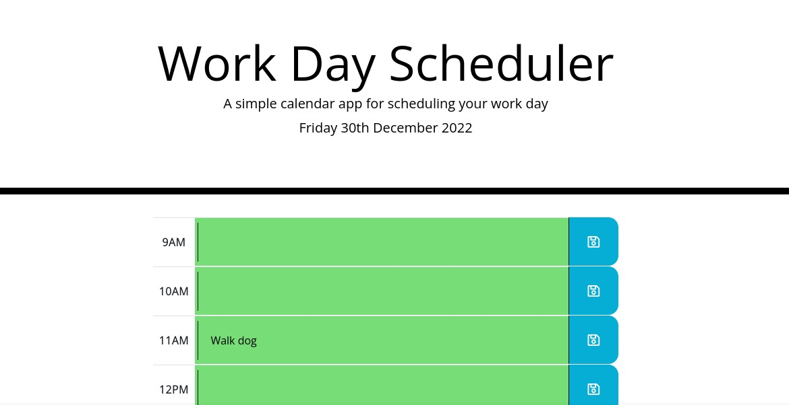
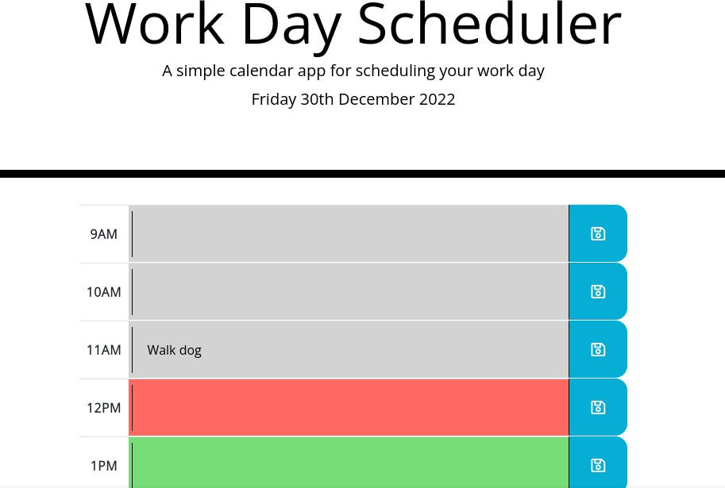

# Workday Scheduler

## Description

This is a Javascript project where the page displays the current date and 9 different hour slots, for the user to enter his schedule/tasks and save them to local storage by using enter or the save button. 
The different hour slots are colour-coded, depending whether the time has passed, it is the current time or it is in the future. 

For this project jQuery was used for selecting different elements from the page, adding event listeners to buttons and elements of the page and for using callback functions when the events are triggered. 

LocalStorage was used to persist user's data and moment.js was used for date and time manipulation. 

## Installation (optional)

If someone wants to, they can download the code from the following repository: 
[Workday Scheduler](https://github.com/QuantumK9/workday-scheduler)

## Usage

The final project can me seen in the following link:

[Quantum K - Workday Scheduler](https://quantumk9.github.io/workday-scheduler/)

## Screenshots

Picture 1:

Picture 2:

## Credits

This challenge was completed by Quantum K (GitHub)

## License 

MIT License